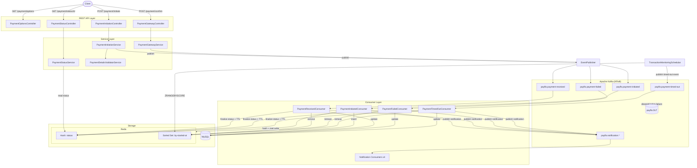
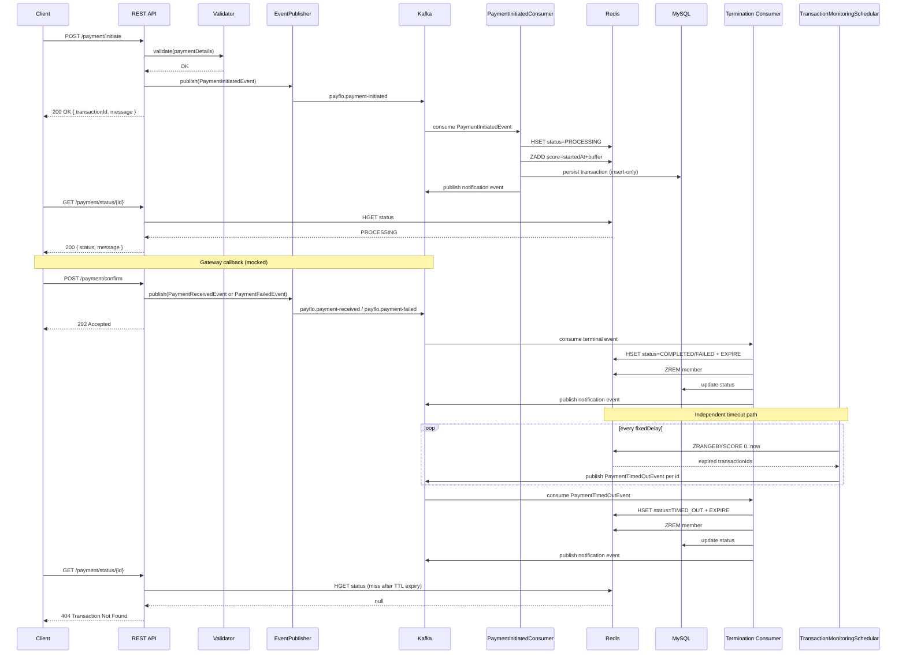

# payflo

**A Kafka-first, event-driven payment processing backbone — built from the ground up to demonstrate real distributed-systems engineering, not a payment gateway integration.**

> payflo does not process real payments. Bank calls, gateway SDKs, and NPCI lookups are intentionally mocked. The entire engineering focus is the event-driven backbone between the start and end of a payment: ordering guarantees, partitioning, consumer groups, idempotency, dead-letter handling, and cache-backed state — the mechanics that matter in a real fintech payments platform.

---

## Table of Contents

- [Core Objective](#core-objective)
- [Features](#features)
- [Architecture Overview](#architecture-overview)
- [Payment Lifecycle](#payment-lifecycle)
- [Event Catalog](#event-catalog)
- [Kafka Topics](#kafka-topics)
- [System Components](#system-components)
- [Technology Stack](#technology-stack)
- [Project Structure](#project-structure)
- [Local Setup](#local-setup)
- [Configuration](#configuration)
- [REST APIs](#rest-apis)
- [Testing the Event Flow](#testing-the-event-flow)
- [Design Decisions](#design-decisions)
- [Reliability & Fault Tolerance](#reliability--fault-tolerance)
- [Future Improvements](#future-improvements)
- [Conclusion](#conclusion)

---

## Core Objective

**Business problem:** Payment systems at scale (Razorpay, CRED, Groww, Juspay-class platforms) cannot afford to hold an HTTP request open while a payment is validated, dispatched to a gateway, confirmed, and settled. That workflow is inherently asynchronous, must survive partial failures, must never double-charge or double-notify a user, and must detect and terminate transactions that silently stall. A synchronous, request-response model breaks down under exactly these constraints.

**Why Event-Driven Architecture:** payflo models the payment lifecycle as a sequence of discrete, independently-processable domain events — `payment-initiated` → `payment-received` / `payment-failed` / `payment-timed-out` — each with its own topic, its own consumer, and its own downstream notification event. This buys:

- **Decoupling** — the REST layer never blocks on downstream processing; it fires an event and returns.
- **Independent scalability** — consumers for validation, persistence, and notification scale independently of the API layer.
- **Natural audit trail** — the event log *is* the history of what happened to a transaction.
- **Resilience** — a slow or crashed consumer doesn't take down the API; messages wait in the topic.

The project exists to build genuine fluency with these mechanics — partition-key ordering, consumer group rebalancing, offset management, dead-letter routing, idempotent processing — using a **self-managed Kafka cluster (KRaft mode, no Zookeeper, no managed Confluent Cloud)**, so every piece of infrastructure is understood rather than assumed.

---

## Features

- **Polymorphic payment initiation** — UPI and Card payment types via a sealed-interface + Jackson-discriminator model, each with independent, extensible validation (VPA format + PSP handle validation; Luhn's algorithm + expiry + CVV validation for cards).
- **Fully event-driven lifecycle** — 8 Kafka topics across payment-lifecycle and notification event groups, with dedicated consumers for each stage.
- **Idempotent consumers** — insert-only persistence semantics (`EntityManager.persist()`) guarantee duplicate Kafka deliveries never produce duplicate side effects.
- **Redis-backed status reads** — MySQL is durable storage only; the hot-path status API reads exclusively from Redis, keeping the database off the request-serving critical path.
- **Sorted-set-driven timeout detection** — a scheduler queries a Redis sorted set for transactions past their deadline and fires a `payment-timed-out` event, with a dedicated consumer owning the actual state transition.
- **Centralized, typed configuration** — every topic name, error message, status message, notification template, and infrastructure property is externalized via `@ConfigurationProperties` records, never hardcoded.
- **Structured exception handling** — a single `PayfloException` hierarchy with per-scenario `ErrorCode`s, resolved by a global `@RestControllerAdvice` into a consistent client-facing error contract.
- **Dead-letter routing** — malformed or undecodable messages are automatically routed to a shared DLT via `DeadLetterPublishingRecoverer`.
- **TTL-based Redis self-cleanup** — terminal transaction states automatically expire out of Redis after a configurable retention window, no separate cleanup job required.
- **Planned:** Atomic Redis check-and-set (Lua) for full partial-write/race-condition hardening (Phase 4.4).

---

## Architecture Overview

payflo is a **single Spring Boot monolith** — microservices were explicitly rejected to keep the entire learning focus on Kafka behavior rather than distributed-deployment concerns. The monolith is internally organized by strict separation of concerns: REST controllers never touch Kafka directly, services never contain persistence logic, and consumers own all state-transition business logic.

| Layer                   | Responsibility                                                                                                     |
|-------------------------|--------------------------------------------------------------------------------------------------------------------|
| **Client**              | Sends payment requests, polls status                                                                               |
| **REST API**            | Accepts requests, validates structurally, fires initiating events — never blocks on downstream processing          |
| **Producers**           | `EventPublisher` — single, centralized publish path for every event in the system                                  |
| **Message Broker**      | Self-managed Apache Kafka (KRaft mode) — 8 topics across 2 lifecycle groups + 1 shared DLT                         |
| **Consumers**           | One consumer per event type — own all business logic, persistence, and cache mutation                              |
| **Database**            | MySQL — durable, authoritative transaction record; no longer queried on the status-read hot path                   |
| **Cache**               | Redis — hash for O(1) status lookups, sorted set for timeout-range queries                                         |
| **Scheduler**           | `TransactionMonitoringSchedular` — pure trigger; detects expired transactions and fires an event, owns no mutation |
| **Notification system** | Dedicated notification consumers per lifecycle stage — currently log/print, structurally ready for real dispatch   |



---

## Payment Lifecycle



---

## Event Catalog

| Event                               | Producer                         | Consumer                   | Purpose                                                                                                                                                                                                                                                               | Topic                                   |
|-------------------------------------|----------------------------------|----------------------------|-----------------------------------------------------------------------------------------------------------------------------------------------------------------------------------------------------------------------------------------------------------------------|-----------------------------------------|
| `PaymentInitiatedEvent`             | `PaymentInitiationService`       | `PaymentInitiatedConsumer` | Fired when a structurally-valid payment request is accepted. Carries `transactionId`, `amount`, `paymentType`, `startedAt` — `startedAt` is the customer-facing clock start, used later for timeout scoring.                                                          | `payflo.payment-initiated`              |
| `PaymentReceivedEvent`              | `PaymentGatewayService`          | `PaymentReceivedConsumer`  | Fired when the (mocked) gateway callback reports success. Terminates the transaction as `COMPLETED`.                                                                                                                                                                  | `payflo.payment-received`               |
| `PaymentFailedEvent`                | `PaymentGatewayService`          | `PaymentFailedConsumer`    | Fired when the gateway callback reports failure. Terminates the transaction as `FAILED`.                                                                                                                                                                              | `payflo.payment-failed`                 |
| `PaymentTimedOutEvent`              | `TransactionMonitoringSchedular` | `PaymentTimedOutConsumer`  | Fired by the scheduler for any transaction whose Redis sorted-set score has passed. Carries only `transactionId` — the deadline itself is derivable from `startedAt` (in MySQL) + the configured buffer, so it is deliberately not duplicated into the event payload. | `payflo.payment-timed-out`              |
| `PaymentInitiatedNotificationEvent` | `PaymentInitiatedConsumer`       | Notification consumer      | Fired after the initiated-consumer's primary work completes. Message resolved from a template keyed by the *triggering* event's topic.                                                                                                                                | `payflo.notification.payment-initiated` |
| `PaymentCompletedNotificationEvent` | `PaymentReceivedConsumer`        | Notification consumer      | User-facing "payment successful" notification.                                                                                                                                                                                                                        | `payflo.notification.payment-completed` |
| `PaymentFailedNotificationEvent`    | `PaymentFailedConsumer`          | Notification consumer      | User-facing "payment failed" notification.                                                                                                                                                                                                                            | `payflo.notification.payment-failed`    |
| `PaymentTimedOutNotificationEvent`  | `PaymentTimedOutConsumer`        | Notification consumer      | User-facing "payment timed out" notification.                                                                                                                                                                                                                         | `payflo.notification.payment-timed-out` |

> All 8 event records implement a shared `PaymentEvent` interface exposing `topic()` and `key()`, published through a single `EventPublisher.publish(PaymentEvent)` method — no per-event publishing boilerplate.

---

## Kafka Topics

| Topic                                   | Producer                                          | Consumer                   | Description                                     |
|-----------------------------------------|---------------------------------------------------|----------------------------|-------------------------------------------------|
| `payflo.payment-initiated`              | `PaymentInitiationService`                        | `PaymentInitiatedConsumer` | Entry point of the lifecycle                    |
| `payflo.payment-received`               | `PaymentGatewayService`                           | `PaymentReceivedConsumer`  | Success termination                             |
| `payflo.payment-failed`                 | `PaymentGatewayService`                           | `PaymentFailedConsumer`    | Failure termination                             |
| `payflo.payment-timed-out`              | `TransactionMonitoringSchedular`                  | `PaymentTimedOutConsumer`  | Timeout termination                             |
| `payflo.notification.payment-initiated` | `PaymentInitiatedConsumer`                        | Notification consumer      | Initiation notice                               |
| `payflo.notification.payment-completed` | `PaymentReceivedConsumer`                         | Notification consumer      | Success notice                                  |
| `payflo.notification.payment-failed`    | `PaymentFailedConsumer`                           | Notification consumer      | Failure notice                                  |
| `payflo.notification.payment-timed-out` | `PaymentTimedOutConsumer`                         | Notification consumer      | Timeout notice                                  |
| `payflo.DLT`                            | Kafka framework (`DeadLetterPublishingRecoverer`) | — (manual inspection)      | Shared dead-letter target for every topic above |

**Partitioning strategy** — every event is keyed by `transactionId`, guaranteeing all events for a single transaction land on the same partition and are processed in strict order by a single consumer thread. Partition count is treated as fixed at creation time — changing it later would break `hash(key) % N` ordering guarantees for any in-flight transaction, so topic creation is a deliberate, separate infrastructure step, not baked into Docker Compose or `application.yml`.

**Ordering guarantees** — per-key ordering only (Kafka's native guarantee); no global ordering across different transactions, which is the correct and sufficient guarantee for this domain.

**Consumer groups** — each consumer type runs in its own consumer group, so lifecycle consumers and notification consumers scale and rebalance independently.

**Retry handling** — deserialization failures are non-retryable by nature (a malformed payload will never deserialize successfully) and are routed directly to the DLT rather than retried in a loop.

**Dead-letter topics** — a single shared `payflo.DLT` receives any message that fails deserialization, using Spring Kafka's `DeadLetterPublishingRecoverer`. Payloads that fail due to trusted-package/class-name mismatches are republished as raw base64 bytes, since the value deserializer itself couldn't decode them.

**Idempotency** — every consumer relies on `EntityManager.persist()` (not `JpaRepository.save()`) for MySQL writes, catching `DataIntegrityViolationException` on a duplicate delivery. `save()` was explicitly rejected because it performs a silent select-then-merge for manually-assigned IDs (UUIDv7), which would silently overwrite rather than reject a duplicate.

---

## System Components

### REST API
Four `@RestController` classes (`PaymentOptionsController`, `PaymentInitiationController`, `PaymentGatewayController`, `PaymentStatusController`), all sharing the `/payment/*` namespace. Split by single-responsibility-per-class, not by URL fragmentation — the client sees one coherent `/payment` resource. Confirmed at the framework level that Spring detects true path+method collisions at startup (`IllegalStateException: Ambiguous mapping`), so class-splitting carries no silent-routing risk.

### Producer Layer
`EventPublisher` — one method, `publish(PaymentEvent)`, resolves the target topic via `KafkaTopicResolver` and sends through a shared `KafkaTemplate`. Deliberately kept as a concrete, Kafka-only class rather than an interface with swappable broker implementations — a real design discussion was had (`@ConditionalOnProperty`, `@Primary`, `@Qualifier`), but concluded to be YAGNI for a Kafka-focused learning project with no intent to swap brokers.

### Kafka Infrastructure
`KafkaTopic` (enum of all 9 topics including the DLT), `KafkaTopicsProperties` (`@ConfigurationProperties` record backing the enum with real topic-name strings from config), and `KafkaTopicResolver` (exhaustive switch bridging enum → string). This indirection exists specifically to eliminate typo/drift risk between code and topic configuration.

### Consumers
One consumer class per event type, each owning 100% of that event's business logic — persistence, cache mutation, and notification-event construction. Notification consumers remain intentionally pure log/print, with zero business logic, to keep the notification *pipeline* structurally separate from notification *dispatch* (which is a planned future integration point).

### Validation Layer
`PaymentDetailsValidatorService` dispatches via an exhaustive pattern-matching `switch` (record deconstruction) to `UpiValidator` or `CardValidator` — two independently extensible validator classes implementing a shared `PaymentValidator<T>` interface. UPI validation runs a 5-step chain (case-normalization → separator-count check → identifier regex → PSP-handle-format regex → PSP-handle set-membership lookup). Card validation runs a 4-step chain (number-format regex → CVV-format regex → Luhn's algorithm → expiry check via `YearMonth`).

### Redis (Cache Layer)
Two independently-reasoned service+repository pairs under `cache/`:
- **`RedisHashService` / `RedisHashRepository`** — owns per-transaction status (`payflo:payment-transaction:{transactionId}` → `status` field). No TTL while pending; TTL applied only at terminal-state finalization, so completed records self-clean without a dedicated cleanup job.
- **`RedisZSetService` / `RedisZSetRepository`** — owns the single global sorted set (`payflo:processing-payment-transactions:by-started-at`) used exclusively for timeout-range detection.

Kept as two separate pairs (not one umbrella cache service) because status-tracking and timeout-tracking have different reasons to change, even though they currently share one underlying store.

### MySQL
Durable, authoritative record of every transaction. No longer part of the status-read hot path as of Phase 4.3 — Redis absorbs all status reads; MySQL exists purely for durability and (in principle) audit/reporting.

### Scheduler
`TransactionMonitoringSchedular` — a deliberately thin, pure-trigger component. It queries Redis (`ZRANGEBYSCORE` up to now), and for every expired `transactionId`, constructs and publishes a `PaymentTimedOutEvent`. It performs **no mutation whatsoever** — all state transition is owned by `PaymentTimedOutConsumer`, keeping detection and business logic in separate, single-responsibility components. Runs on `@Scheduled(fixedDelayString = ...)`, chosen deliberately over `fixedRate` so each run only starts after the previous run has fully completed, giving natural cooldown headroom.

### Notification Module
Four dedicated notification consumers, one per lifecycle-terminating event, each resolving a message template via `NotificationMessageResolver` keyed by the *triggering* event's topic (not the notification event's own topic — constructing the notification event requires the resolved message as a constructor argument, which would otherwise create a circular dependency).

### Exception Handling
An abstract `PayfloException` (carrying an `ErrorCode`) is the base for all domain exceptions. `GlobalExceptionHandler` (`@RestControllerAdvice`) provides both a generic fallback and specific handlers where HTTP status genuinely differs, and additionally normalizes two framework-level exceptions (`MethodArgumentTypeMismatchException`, `HttpMessageNotReadableException`) into the same `ErrorResponse` shape used everywhere else, so clients see one consistent error contract regardless of failure origin.

---

## Technology Stack

| Category         | Choice                                                                                                                         |
|------------------|--------------------------------------------------------------------------------------------------------------------------------|
| Language         | Java 21                                                                                                                        |
| Framework        | Spring Boot                                                                                                                    |
| Database         | MySQL                                                                                                                          |
| Cache            | Redis (self-managed, via Docker)                                                                                               |
| Message Broker   | Apache Kafka — KRaft mode, `apache/kafka` image (self-managed, not Confluent Cloud)                                            |
| Build Tool       | Maven                                                                                                                          |
| Containerization | Docker + Docker Compose                                                                                                        |
| Testing          | JUnit, Mockito                                                                                                                 |
| API Testing      | Postman                                                                                                                        |
| IDE              | IntelliJ IDEA                                                                                                                  |
| Version Control  | Git / GitHub                                                                                                                   |
| Key Libraries    | Jackson (`jackson-datatype-jsr310` for `YearMonth` support), Spring Data JPA, Spring Data Redis (Lettuce client), Spring Kafka |

---

## Project Structure

```
payflo/
├── src/main/java/com/vishal/payflo/
│   ├── PayfloApplication.java
│   │
│   ├── configs/
│   │   ├── KafkaConfigs.java
│   │   ├── RedisConfig.java
│   │   ├── RedisConnectionProperties.java
│   │   ├── RedisKeysProperties.java
│   │   ├── RedisStatusTtlProperties.java
│   │   ├── PaymentTimeoutProperties.java
│   │   ├── VpaValidationProperties.java
│   │   ├── PaymentStatusMessagesProperties.java
│   │   ├── ExceptionMessagesProperties.java
│   │   └── NotificationMessageProperties.java
│   │
│   ├── controller/
│   │   ├── PaymentOptionsController.java
│   │   ├── PaymentInitiationController.java
│   │   ├── PaymentGatewayController.java
│   │   └── PaymentStatusController.java
│   │
│   ├── service/
│   │   ├── PaymentInitiationService.java
│   │   ├── PaymentGatewayService.java
│   │   ├── PaymentStatusService.java
│   │   └── PaymentTransactionService.java
│   │
│   ├── validation/
│   │   ├── PaymentDetailsValidatorService.java
│   │   ├── PaymentValidator.java
│   │   ├── UpiValidator.java
│   │   └── CardValidator.java
│   │
│   ├── kafka/
│   │   ├── topics/
│   │   │   ├── KafkaTopic.java
│   │   │   ├── KafkaTopicsProperties.java
│   │   │   └── KafkaTopicResolver.java
│   │   ├── events/
│   │   │   ├── PaymentEvent.java
│   │   │   ├── PaymentInitiatedEvent.java
│   │   │   ├── PaymentReceivedEvent.java
│   │   │   ├── PaymentFailedEvent.java
│   │   │   ├── PaymentTimedOutEvent.java
│   │   │   └── notification/*.java
│   │   ├── consumers/
│   │   │   ├── PaymentInitiatedConsumer.java
│   │   │   ├── PaymentReceivedConsumer.java
│   │   │   ├── PaymentFailedConsumer.java
│   │   │   ├── PaymentTimedOutConsumer.java
│   │   │   └── notification/*Consumer.java
│   │   └── EventPublisher.java
│   │
│   ├── cache/
│   │   ├── service/
│   │   │   ├── RedisHashService.java
│   │   │   └── RedisZSetService.java
│   │   └── repository/
│   │       ├── RedisHashRepository.java
│   │       └── RedisZSetRepository.java
│   │
│   ├── scheduled/
│   │   └── TransactionMonitoringSchedular.java
│   │
│   ├── dto/
│   │   ├── ApiResponse.java
│   │   ├── paymentdetails/
│   │   │   ├── PaymentDetails.java
│   │   │   ├── UpiDetails.java
│   │   │   └── CardDetails.java
│   │   ├── requestDto/
│   │   │   ├── PaymentInitiateRequestDto.java
│   │   │   └── PaymentConfirmRequestDto.java
│   │   └── responseDto/
│   │       ├── PaymentInitiateResponseDto.java
│   │       ├── PaymentStatusResponseDto.java
│   │       └── PaymentOptionsResponseDto.java
│   │
│   ├── advice/
│   │   ├── exceptions/
│   │   │   ├── PayfloException.java
│   │   │   ├── PaymentTransactionNotFoundException.java
│   │   │   ├── InvalidVpaException.java
│   │   │   └── InvalidCardDetailsException.java
│   │   ├── enums/
│   │   │   └── ErrorCode.java
│   │   ├── ErrorResponse.java
│   │   └── GlobalExceptionHandler.java
│   │
│   └── enums/
│       ├── TransactionStatus.java
│       ├── PaymentType.java
│       └── GatewayStatus.java
│
├── src/test/java/com/vishal/payflo/
│
├── docker-compose.yml
├── .env
├── application.yml
└── pom.xml
```

---

## Local Setup

### Prerequisites
- Java 21+
- Maven
- Docker & Docker Compose

### 1. Clone the repository
```bash
git clone https://github.com/<your-username>/payflo.git
cd payflo
```

### 2. Configure environment variables
Create a `.env` file in the project root:
```bash
# MySQL
MYSQL_URL=jdbc:mysql://localhost:3306/payflo
MYSQL_USERNAME=payflo_user
MYSQL_PASSWORD=your_password

# Kafka
KAFKA_BOOTSTRAP_SERVERS=localhost:9092
KAFKA_TRUSTED_PACKAGES=com.vishal.payflo.kafka.events
KAFKA_OFFSETS_TOPIC_REPLICATION_FACTOR=1

# Redis
REDIS_HOST=localhost
REDIS_PORT=6379
REDIS_PAYMENT_TRANSACTION_HASH_PREFIX=payflo:payment-transaction:
REDIS_PROCESSING_TRANSACTIONS_ZSET_KEY=payflo:processing-payment-transactions:by-started-at
REDIS_PAYMENT_TRANSACTION_HASH_STATUS_KEY=status
PAYMENT_TIMEOUT_BUFFER_MINUTES=10
PAYMENT_STATUS_TTL_HOURS=1
TRANSACTION_MONITOR_FIXED_DELAY_MS=30000

# Validation
VALIDATION_VPA_ALLOWED_HANDLES=okaxis,okhdfcbank,oksbi,okicici,ybl,axl,ibl,paytm,apl,upi,sbi,airtel,kotak,icici
```

> **Note:** `KAFKA_OFFSETS_TOPIC_REPLICATION_FACTOR` must be explicitly set to `1` on a single-broker setup — omitting it silently breaks all consumer group functionality.

### 3. Start infrastructure
```bash
docker compose up -d
```
This brings up Kafka (KRaft mode), MySQL, and Redis.

> **Windows / Git Bash:** prefix Docker commands with `MSYS_NO_PATHCONV=1` to prevent path mangling into Windows-style paths.

### 4. Create Kafka topics
Topic creation is a deliberate, separate infrastructure step (not part of Compose or `application.yml`), since partition count is fixed at creation and must not change under an in-flight system:
```bash
MSYS_NO_PATHCONV=1 docker exec -it <kafka_container_name> \
  /opt/kafka/bin/kafka-topics.sh --create \
  --topic payflo.payment-initiated \
  --bootstrap-server localhost:9092 \
  --partitions 3 --replication-factor 1
```
Repeat for all 9 topics listed in [Kafka Topics](#kafka-topics).

### 5. Build the application
```bash
mvn clean install
```

### 6. Run the application
```bash
mvn spring-boot:run
```

### 7. Verify services
```bash
# Kafka topics
MSYS_NO_PATHCONV=1 docker exec -it <kafka_container_name> \
  /opt/kafka/bin/kafka-topics.sh --list --bootstrap-server localhost:9092

# Redis
docker exec -it <redis_container_name> redis-cli PING

# MySQL
docker exec -it <mysql_container_name> mysql -u payflo_user -p -e "SHOW TABLES;"
```

---

## Configuration

| Variable                                          | Purpose                                                                                                        |
|---------------------------------------------------|----------------------------------------------------------------------------------------------------------------|
| `MYSQL_URL` / `MYSQL_USERNAME` / `MYSQL_PASSWORD` | JDBC connection to the durable transaction store                                                               |
| `KAFKA_BOOTSTRAP_SERVERS`                         | Kafka broker address                                                                                           |
| `KAFKA_TRUSTED_PACKAGES`                          | Packages Jackson's Kafka deserializer trusts — must be kept in sync with any package refactor of event classes |
| `KAFKA_OFFSETS_TOPIC_REPLICATION_FACTOR`          | Must be `1` on single-broker local setups                                                                      |
| `REDIS_HOST` / `REDIS_PORT`                       | Redis connection                                                                                               |
| `REDIS_PAYMENT_TRANSACTION_HASH_PREFIX`           | Key prefix for the per-transaction status hash                                                                 |
| `REDIS_PROCESSING_TRANSACTIONS_ZSET_KEY`          | Global key for the timeout-tracking sorted set                                                                 |
| `REDIS_PAYMENT_TRANSACTION_HASH_STATUS_KEY`       | Hash field name storing the transaction status                                                                 |
| `PAYMENT_TIMEOUT_BUFFER_MINUTES`                  | Minutes after `startedAt` before a transaction is considered timed out                                         |
| `PAYMENT_STATUS_TTL_HOURS`                        | Hours a terminal-state Redis entry is retained before self-expiring                                            |
| `TRANSACTION_MONITOR_FIXED_DELAY_MS`              | Scheduler polling interval for timeout detection                                                               |
| `VALIDATION_VPA_ALLOWED_HANDLES`                  | Comma-separated list of recognized UPI PSP handles                                                             |

---

## REST APIs

| Method | Endpoint                          | Description                                                                                                                  |
|--------|-----------------------------------|------------------------------------------------------------------------------------------------------------------------------|
| `GET`  | `/payment/options`                | Returns all available `PaymentType` values                                                                                   |
| `POST` | `/payment/initiate`               | Accepts a polymorphic payment request (UPI or Card), validates it, fires `payflo.payment-initiated`, returns `transactionId` |
| `POST` | `/payment/confirm`                | Mocked gateway callback; fires `payflo.payment-received` or `payflo.payment-failed`; returns `202 Accepted` with no body     |
| `GET`  | `/payment/status/{transactionId}` | Returns current transaction status, read from Redis; `404` if the transaction is unknown or its record has expired           |

**Example — initiate a UPI payment:**
```bash
curl -X POST http://localhost:8080/payment/initiate \
  -H "Content-Type: application/json" \
  -d '{
        "amount": 499.00,
        "paymentDetails": {
          "type": "UPI",
          "vpa": "vishal@oksbi"
        }
      }'
```

**Example — confirm a payment:**
```bash
curl -X POST http://localhost:8080/payment/confirm \
  -H "Content-Type: application/json" \
  -d '{
        "transactionId": "<uuid>",
        "gatewayStatus": "SUCCESS"
      }'
```

**Example — check status:**
```bash
curl http://localhost:8080/payment/status/<uuid>
```

---

## Testing the Event Flow

### 1. Start infrastructure and the application
```bash
docker compose up -d
mvn spring-boot:run
```

### 2. Create a payment
```bash
curl -X POST http://localhost:8080/payment/initiate \
  -H "Content-Type: application/json" \
  -d '{"amount": 250.00, "paymentDetails": {"type": "UPI", "vpa": "test@oksbi"}}'
```
Note the returned `transactionId`.

### 3. Observe the Kafka event
```bash
MSYS_NO_PATHCONV=1 docker exec -it <kafka_container_name> \
  /opt/kafka/bin/kafka-console-consumer.sh \
  --topic payflo.payment-initiated \
  --bootstrap-server localhost:9092 --from-beginning
```

### 4. Verify Redis state
```bash
docker exec -it <redis_container_name> redis-cli
HGETALL payflo:payment-transaction:<transactionId>
ZSCORE payflo:processing-payment-transactions:by-started-at <transactionId>
```

### 5. Verify MySQL
```bash
docker exec -it <mysql_container_name> mysql -u payflo_user -p payflo \
  -e "SELECT * FROM payment_transaction WHERE transaction_id = '<transactionId>';"
```

### 6. Confirm the payment and re-check status
```bash
curl -X POST http://localhost:8080/payment/confirm \
  -H "Content-Type: application/json" \
  -d '{"transactionId": "<transactionId>", "gatewayStatus": "SUCCESS"}'

curl http://localhost:8080/payment/status/<transactionId>
```
Verify in Redis that the hash's `status` field is now `COMPLETED`, a `TTL` is set on the key, and the transaction has been removed from the sorted set.

### 7. Trigger and observe the timeout flow
Initiate a payment and simply wait past `PAYMENT_TIMEOUT_BUFFER_MINUTES` without confirming it. Watch the scheduler fire:
```bash
MSYS_NO_PATHCONV=1 docker exec -it <kafka_container_name> \
  /opt/kafka/bin/kafka-console-consumer.sh \
  --topic payflo.payment-timed-out \
  --bootstrap-server localhost:9092 --from-beginning
```
Then confirm the transaction's Redis status is `TIMED_OUT` and it has been removed from the sorted set.

### 8. Inspect the Dead Letter Topic
```bash
MSYS_NO_PATHCONV=1 docker exec -it <kafka_container_name> \
  /opt/kafka/bin/kafka-console-consumer.sh \
  --topic payflo.DLT \
  --bootstrap-server localhost:9092 --from-beginning
```
To manually produce a malformed message and trigger DLT routing:
```bash
MSYS_NO_PATHCONV=1 docker exec -it <kafka_container_name> \
  /opt/kafka/bin/kafka-console-producer.sh \
  --topic payflo.payment-timed-out \
  --bootstrap-server localhost:9092
> {"malformed": "payload"}
```

---

## Design Decisions

**Why Kafka over a simpler queue.** payflo needs replayable, ordered, partition-keyed event history — properties a simple message queue doesn't provide by default. Kafka's retention model also means a stalled consumer doesn't lose events, only delays processing.

**Why asynchronous messaging over synchronous service calls.** A synchronous chain (validate → charge → persist → notify, all in one request) ties API latency to the slowest downstream step and offers no natural retry/replay boundary. Firing an event and returning immediately decouples acceptance from processing.

**Why Redis for status reads.** Polling `/payment/status` is the highest-frequency read in the system (a typical frontend polls repeatedly until a terminal state). Serving that from MySQL on every call wastes the database's capacity for genuinely durable operations; Redis absorbs the hot path entirely.

**Why idempotent consumers.** Kafka's at-least-once delivery guarantee means every consumer must tolerate redelivery. `EntityManager.persist()` was chosen deliberately over `JpaRepository.save()` specifically because `save()`'s silent select-then-merge behavior for manually-assigned IDs would silently *update* on a duplicate delivery rather than reject it — the opposite of the desired idempotency guarantee.

**Why dead-letter topics.** Deserialization failures are permanent, not transient — retrying a malformed payload will never succeed. Routing straight to a DLT avoids infinite retry loops and gives a place to inspect and diagnose bad messages without blocking the partition.

**Why event choreography over central orchestration.** Each consumer reacts to the event in front of it and produces the next event in the chain; there is no central "saga coordinator" deciding what happens next. This keeps each component small and independently testable, at the cost of the overall flow being implicit rather than centrally visible — an accepted tradeoff at this system's scale.

**Why the scheduler publishes events instead of mutating state directly.** Business logic — updating status, removing from the sorted set, updating MySQL — belongs in exactly one place: the consumer that already owns that logic for every other trigger of the same state transition. If the scheduler mutated state directly, timeout-triggered transitions would follow a different code path than gateway-triggered transitions, doubling the surface area for bugs and drift.

**Why notifications are event-driven.** Keeping notification dispatch as its own consumer, subscribed to its own topic, means notification delivery can fail, retry, or be swapped for a real provider (SMS/push/email) without touching the core payment state machine at all.

**Why REST only initiates workflows.** `POST /payment/initiate` and `POST /payment/confirm` both return before any business logic executes — `202 Accepted` with no response body for confirm, specifically to avoid implying a confirmed state that doesn't yet exist. This is a deliberate signal to API consumers that the system is asynchronous by design, not an oversight.

---

## Reliability & Fault Tolerance

| Concern                                                                              | Status                                        | Notes                                                                                                                              |
|--------------------------------------------------------------------------------------|-----------------------------------------------|------------------------------------------------------------------------------------------------------------------------------------|
| Duplicate message handling                                                           | **Implemented**                               | `EntityManager.persist()` + `DataIntegrityViolationException` catch on every consumer                                              |
| Idempotency (DB layer)                                                               | **Implemented**                               | Unique constraint, atomic at the storage engine                                                                                    |
| Idempotency (Redis/notification-flag layer)                                          | **Planned (Phase 4.4)**                       | Atomic Redis check-and-set via Lua script                                                                                          |
| Retry behavior                                                                       | **Implemented (by design, not by mechanism)** | Deserialization failures route to DLT rather than retrying, since retry cannot succeed on a permanently malformed payload          |
| Consumer recovery                                                                    | **Implemented**                               | Kafka's own consumer-group rebalancing; no custom recovery logic required                                                          |
| Dead-letter strategy                                                                 | **Implemented**                               | Single shared `payflo.DLT` via `DeadLetterPublishingRecoverer`                                                                     |
| Redis consistency                                                                    | **Partially implemented**                     | Reads/writes work correctly under single-threaded assumptions; concurrent-redelivery races explicitly out of scope until Phase 4.4 |
| Database consistency                                                                 | **Implemented**                               | MySQL remains the durable source of truth; unique constraints enforce non-duplication                                              |
| Event replay                                                                         | **Implemented (by Kafka's nature)**           | Retained topic history allows reprocessing from any offset                                                                         |
| Timeout handling                                                                     | **Implemented**                               | Sorted-set score-based detection + scheduler + dedicated consumer                                                                  |
| Partial-write cascade (DB succeeds, Redis write crashes, redelivery double-notifies) | **Planned (Phase 4.4)**                       | Design direction agreed: manual checkpoint/resume pattern with an atomic Redis check-and-set                                       |

---

## Future Improvements

- **Transactional Outbox Pattern** — eliminate the dual-write problem between MySQL and Kafka at its root, rather than the checkpoint/resume mitigation planned for Phase 4.4.
- **Saga Pattern (formalized)** — the project already implements choreography-based event flow; a future iteration could introduce explicit saga state tracking for cross-service consistency if payflo were ever split into real services.
- **Distributed Tracing / OpenTelemetry** — trace a transaction's full journey across REST → Kafka → consumers → Redis/MySQL as a single correlated trace.
- **Prometheus + Grafana** — consumer lag, DLT volume, and timeout-rate dashboards.
- **Testcontainers** — replace manual `docker compose up` preconditions for integration tests with automatically-provisioned, throwaway Kafka/MySQL/Redis containers (deliberately deferred to the project's dedicated testing phase).
- **Schema Registry (Avro/Protobuf)** — replace JSON + trusted-packages deserialization with schema-enforced, evolvable event contracts.
- **Kubernetes** — multi-instance deployment with horizontal consumer scaling per topic.
- **Multi-instance deployment** — validate consumer-group rebalancing and partition reassignment under real horizontal scale, beyond the current single-instance setup.
- **Advanced monitoring / alerting** — DLT-volume and consumer-lag-based alerting integrated with the observability stack above.

---

## Conclusion

payflo demonstrates hands-on fluency with the mechanics that separate "used Kafka" from "understands Kafka": partition-keyed ordering, consumer-group semantics, dead-letter routing, and idempotent processing under at-least-once delivery — all built on a self-managed cluster rather than a managed service, and all reasoned through deliberately rather than defaulted into. Beyond messaging, the project reflects disciplined backend engineering more broadly: single-responsibility service/repository layering, centralized and typed configuration, a consistent exception-handling contract, and Redis introduced not as a cache-for-cache's-sake but as a considered architectural response to a specific hot-path problem. What remains — atomic partial-write hardening — is scoped, designed, and explicitly the next and final piece of core implementation work.